Please find the attached postman snips

**USER MANAGEMENT**

**Register:** 
/api/v1.0/blogsite/user/register

**Login**
api/v1.0/blogsite/user/login
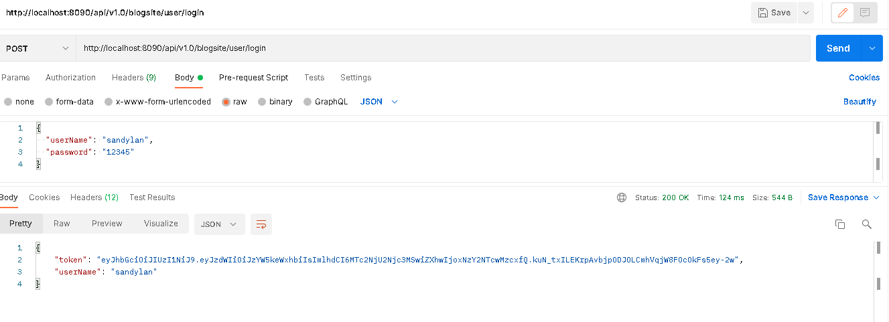

**BLOG MANAGEMENT**

**Create blog**
/api/v1.0/blogsite/blog/add
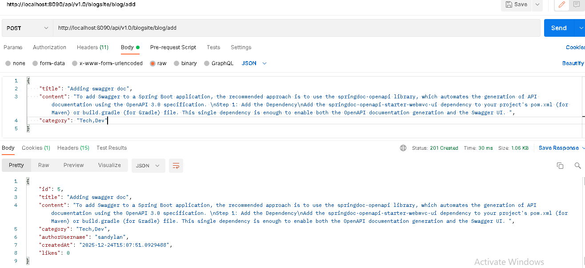

**All Blogs**
/api/v1.0/blogsite/blog
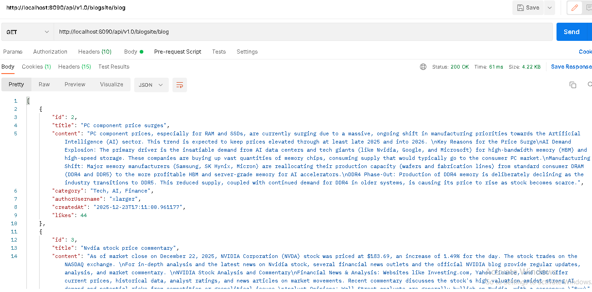

**Blogs by user**
api/v1.0/blogsite/blog/author/sandylan
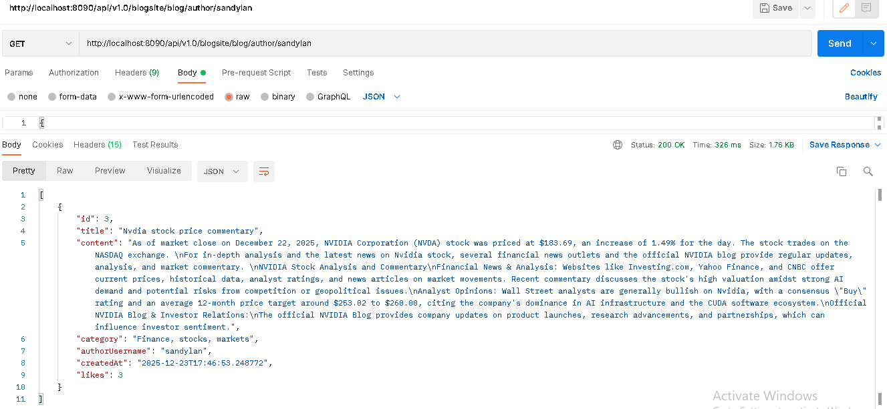

**Delete blog**
/api/v1.0/blogsite/blog/5
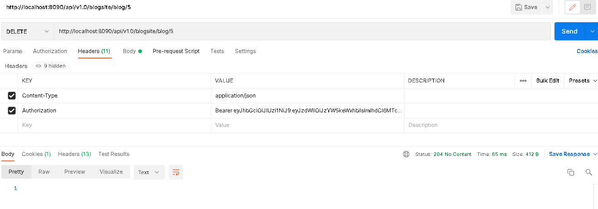

**APPLICATION SNAPSHOTS**

**LOGIN SCREEN**
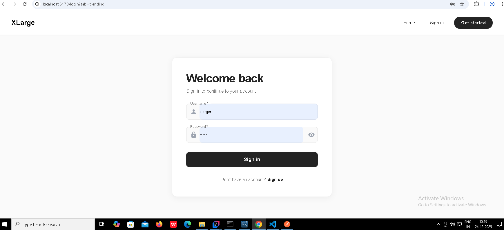

**Register Screen**

**Landing page/ All blogs list**
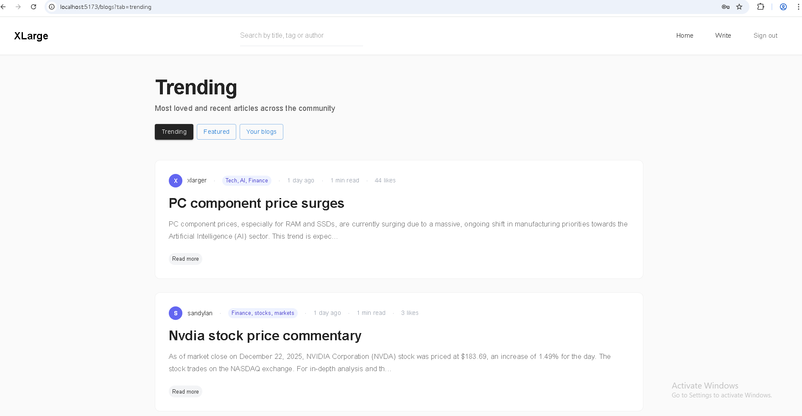

**Blog read view**
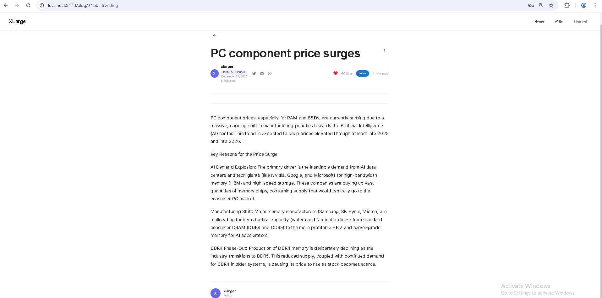

**List of blogs from a user**
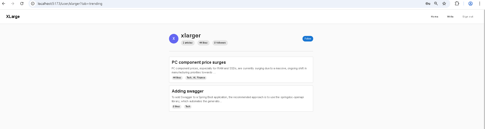

**Blog filtered based on search**
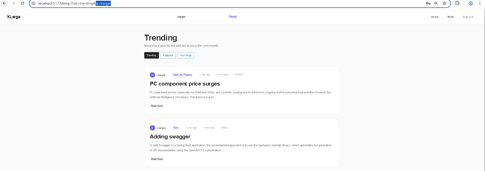

**Create new blog**
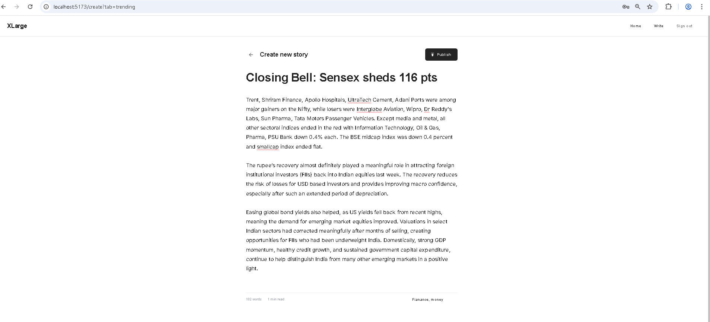

**Delete blog**
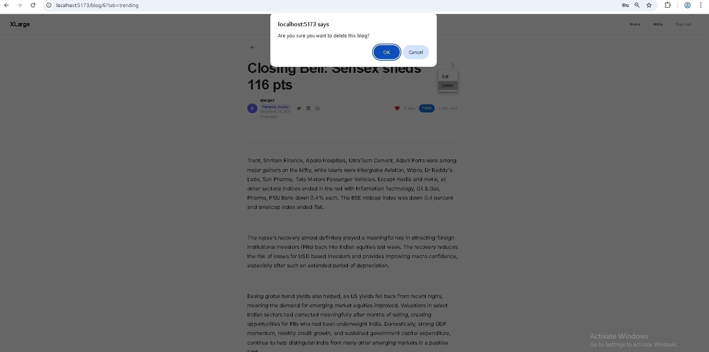